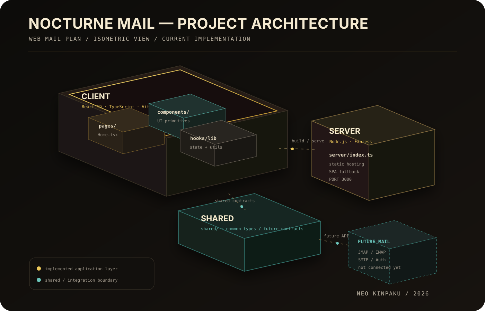

# Nocturne Mail

> **Neo Kinpaku 스타일의 고급 웹메일 UI 프로토타입**  
> 실제 메일 서버에 연결된 완성형 메일 서비스가 아니라, 메일 클라이언트의 화면 구성과 인터랙션을 설계·검증하기 위한 프론트엔드 프로젝트입니다.

## 프로젝트 소개

`web_mail_plan`은 일반적인 웹메일의 정보 구조를 유지하면서도 Gmail·Outlook과는 다른 시각적 경험을 실험하기 위해 만든 웹메일 인터페이스 프로토타입입니다.

프로젝트 내부에서는 이 제품을 **Nocturne Mail**이라고 부릅니다.

디자인 방향은 **Neo Kinpaku**입니다. 일본식 금박(Kinpaku)의 얇고 불규칙한 선, 우루시 래커처럼 깊은 어두운 표면, 청록색 파티나 신호를 현대적인 메일 클라이언트 UI와 결합하는 것을 목표로 합니다.

현재 구현은 UI/UX 프로토타입 단계이며 받은편지함, 별표, 보관, 검색, 메일 읽기, 작성창 등의 동작을 실제 서비스처럼 체험할 수 있도록 구성되어 있습니다. 다만 화면에 표시되는 메일은 목업 데이터이며 IMAP, SMTP, JMAP 등의 실제 메일 서버와 연결되어 있지는 않습니다.

---

## 현재 구현된 내용

### 메일함 UI

- 받은편지함
- 별표 표시
- 다시 알림
- 보낸편지함
- 임시보관함
- 보관함
- 라벨/카테고리 표시
- 읽음 / 안읽음 상태 표현
- 별표 상태 표현
- 첨부파일 상태 표현
- 선택된 메일 본문 보기

### 기본 인터랙션

- 메일 선택 및 내용 보기
- 메일 검색/필터링 UI
- 별표 토글
- 보관 관련 UI
- 새로고침 UI
- 메일 작성(Compose) 인터페이스
- 각종 툴바 액션
- 구현되지 않은 기능에 대한 안내 토스트
- 반응형 레이아웃

### 디자인 특징

- 비대칭 3열 데스크톱 레이아웃
- 왼쪽 메일 네비게이션
- 중앙 메일 작업 영역
- 오른쪽 컨텍스트 패널
- 금박을 연상시키는 골드 포인트
- 따뜻한 흑갈색 계열의 래커 배경
- 읽지 않은 메일 및 상태 표시용 청록색 Patina 포인트
- 작은 모노스페이스 상태 레이블
- 짧고 절제된 UI 애니메이션
- 모바일/태블릿 대응 레이아웃

---

## 중요한 점: 실제 메일 서비스는 아닙니다

현재 버전에는 실제 메일 송수신 기능이 없습니다.

아래 기능은 아직 연결되어 있지 않습니다.

- IMAP 서버 연결
- SMTP 서버 연결
- JMAP 서버 연결
- 실제 사용자 로그인/인증
- 서버에서 받은 메일 목록 동기화
- 실제 메일 전송
- 실제 첨부파일 업로드/다운로드
- 메일 서버의 폴더/라벨 동기화
- 실제 읽음/안읽음 상태 저장
- 실제 별표/보관/삭제 상태 저장

현재 `Home.tsx` 내부에 정의된 목업 메일 데이터를 사용해 화면과 인터랙션을 확인하는 구조입니다.

따라서 이 저장소는 현재 기준으로는 **웹메일 디자인 프로토타입 / 프론트엔드 베이스**라고 보는 것이 가장 정확합니다.

---

## 기술 스택

### Frontend

- React 19
- TypeScript
- Vite
- Tailwind CSS
- Radix UI
- Lucide React
- Framer Motion
- Sonner
- Wouter
- React Hook Form
- Zod

### Server

- Node.js
- Express

현재 Express 서버는 메일 API 서버가 아니라 프로덕션 빌드 결과물을 제공하기 위한 정적 웹 서버 역할을 합니다.

### Package Manager

- pnpm

---

## 프로젝트 구조 — 3D Architecture

프로젝트의 큰 구조를 **등각(Isometric) 3D 다이어그램**으로 표현했습니다. 현재 실제 구현 영역과 향후 메일 서버 연동 영역을 시각적으로 분리해 두었습니다.

<p align="center">
  
</p>

### 구조 해설

**CLIENT**는 현재 프로젝트의 핵심입니다. React와 TypeScript로 구성되며 실제 사용자가 보는 Nocturne Mail UI, 메일 목록, 읽기 화면, 작성 인터페이스 및 상태 처리가 이 영역에 들어갑니다.

**SHARED**는 클라이언트와 서버 사이에서 공통 타입이나 계약을 두기 위한 공간입니다. 현재 규모는 작지만 이후 실제 메일 API를 연결할 때 요청/응답 타입 및 공통 모델을 두기 좋습니다.

**SERVER**는 현재 메일 백엔드가 아닙니다. `server/index.ts`의 Express 서버는 Vite가 빌드한 정적 파일을 제공하고 SPA 라우팅을 처리합니다.

**FUTURE MAIL**은 아직 구현되지 않은 영역입니다. 향후 JMAP, IMAP, SMTP, 인증 서버 등을 연결하면 실제 웹메일 클라이언트로 확장할 수 있습니다. 다이어그램에서 점선으로 표시된 이유도 현재 코드에 연결되어 있지 않기 때문입니다.

<details>
<summary><strong>텍스트 형태의 디렉터리 구조 보기</strong></summary>

```text
web_mail_plan/
├─ client/
│  ├─ public/
│  ├─ index.html
│  └─ src/
│     ├─ components/       # 공통 UI 컴포넌트
│     ├─ contexts/         # React Context 관련 코드
│     ├─ hooks/            # 커스텀 Hooks
│     ├─ lib/              # 유틸리티 / 공통 로직
│     ├─ pages/
│     │  ├─ Home.tsx       # 메인 Nocturne Mail 화면
│     │  └─ NotFound.tsx   # 404 화면
│     ├─ App.tsx           # 애플리케이션 루트
│     ├─ main.tsx          # React 엔트리 포인트
│     ├─ const.ts          # 공통 상수
│     └─ index.css         # 메인 스타일
│
├─ server/
│  └─ index.ts             # 프로덕션 정적 파일 제공용 Express 서버
│
├─ shared/                 # 클라이언트/서버 공용 코드 영역
├─ patches/                # pnpm dependency patch
├─ docs/
│  └─ architecture-3d.svg  # README용 3D 프로젝트 구조도
├─ ideas.md                # 디자인 방향 및 제품 컨셉 문서
├─ verification.md         # 구현 검증 관련 메모
├─ components.json         # UI 컴포넌트 설정
├─ package.json
├─ pnpm-lock.yaml
├─ tsconfig.json
└─ README.md
```

</details>

---

## 설치 방법

### 1. 저장소 Clone

```bash
git clone https://github.com/homesweetlove/web_mail_plan.git
cd web_mail_plan
```

### 2. pnpm 설치

이미 pnpm이 설치되어 있다면 넘어가도 됩니다.

```bash
npm install -g pnpm
```

또는 Node.js의 Corepack을 사용할 수도 있습니다.

```bash
corepack enable
```

### 3. 의존성 설치

```bash
pnpm install
```

---

## 개발 서버 실행

```bash
pnpm dev
```

Vite 개발 서버가 실행됩니다.

터미널에 출력되는 로컬 주소를 브라우저에서 열면 Nocturne Mail UI를 확인할 수 있습니다.

일반적으로 다음과 같은 주소가 사용됩니다.

```text
http://localhost:5173
```

이미 해당 포트를 다른 프로그램이 사용 중이라면 Vite가 다른 포트를 선택할 수 있으므로 터미널 출력 주소를 확인하는 것이 가장 정확합니다.

---

## TypeScript 검사

```bash
pnpm check
```

`tsc --noEmit`을 이용해 TypeScript 타입 오류를 확인합니다.

---

## 코드 포맷팅

```bash
pnpm format
```

프로젝트 전체를 Prettier 기준으로 정리합니다.

---

## 프로덕션 빌드

```bash
pnpm build
```

빌드 과정에서는 다음 작업이 수행됩니다.

1. Vite로 프론트엔드를 빌드합니다.
2. `server/index.ts`를 esbuild로 번들링합니다.
3. 프로덕션 실행에 필요한 결과물을 `dist`에 생성합니다.

빌드가 정상적으로 끝난 뒤에는 다음 명령으로 실행할 수 있습니다.

```bash
pnpm start
```

프로덕션 서버는 기본적으로 다음 포트를 사용합니다.

```text
3000
```

환경 변수 `PORT`를 지정하면 포트를 변경할 수 있습니다.

Linux/macOS:

```bash
PORT=8080 pnpm start
```

PowerShell:

```powershell
$env:PORT=8080
pnpm start
```

---

## Preview 모드

프로덕션에 가까운 형태로 Vite 빌드 결과를 간단하게 확인하려면 다음 명령을 사용할 수 있습니다.

```bash
pnpm preview
```

---

## 주요 npm/pnpm 스크립트

| 명령어 | 설명 |
|---|---|
| `pnpm dev` | Vite 개발 서버 실행 |
| `pnpm build` | 프론트엔드 + Express 서버 프로덕션 빌드 |
| `pnpm start` | 빌드된 프로덕션 서버 실행 |
| `pnpm preview` | Vite preview 서버 실행 |
| `pnpm check` | TypeScript 타입 검사 |
| `pnpm format` | Prettier를 이용해 전체 코드 포맷팅 |

---

## 메인 화면 코드

현재 프로젝트의 중심은 다음 파일입니다.

```text
client/src/pages/Home.tsx
```

이 파일에서 메일 목록을 위한 목업 데이터, 받은편지함 상태, 메일 선택 상태, 검색/필터 관련 UI, 작성 인터페이스 등 Nocturne Mail의 핵심 화면이 구성됩니다.

목업 메일은 대략 다음과 같은 형태의 데이터 구조를 사용합니다.

```ts
type MailItem = {
  id: number;
  sender: string;
  initials: string;
  subject: string;
  preview: string;
  time: string;
  date: string;
  label: string;
  tone: "gold" | "patina" | "paper" | "graphite";
  unread?: boolean;
  starred?: boolean;
  attachment?: boolean;
  body: string[];
};
```

실제 메일 서버를 연결할 경우 이 목업 데이터를 서버 응답 데이터로 교체하면 됩니다.

---

## 디자인 컨셉

자세한 디자인 의도는 [`ideas.md`](./ideas.md)에 정리되어 있습니다.

### Neo Kinpaku

Nocturne Mail의 핵심 디자인 방향입니다.

일본식 금박 공예의 질감과 현대적인 정보 인터페이스를 결합해 일반적인 SaaS 대시보드보다 조금 더 물성 있고 집중감 있는 메일 환경을 만드는 것이 목표입니다.

### 핵심 원칙

#### 1. 장식은 구조가 된다

골드 라인, 작은 레이블, 상태 신호를 단순 장식이 아니라 사용자의 시선을 안내하는 정보 구조로 사용합니다.

#### 2. 검은색을 단순한 검정으로 사용하지 않는다

페이지 전체를 `#000000` 같은 평면적인 검정으로 만드는 대신 따뜻한 흑갈색과 흑연색의 여러 단계를 사용해 깊이를 만듭니다.

#### 3. 높은 정보 밀도와 여백을 동시에 사용한다

메일 목록은 빠르게 훑어볼 수 있도록 밀도 있게 유지하지만 검색, 제목, 읽기 영역에는 충분한 여백을 제공합니다.

#### 4. 인터랙션은 조용하고 빠르게

과도한 글로우, 바운스, 큰 애니메이션 대신 짧은 이동과 색상 변화로 상태를 전달합니다.

---

## 반응형 디자인

### Desktop

```text
┌──────────────┬────────────────────────────┬──────────────────┐
│ Navigation   │ Mail workspace             │ Context rail     │
│              │                            │                  │
│ Inbox        │ Mail list / message        │ Status / details │
│ Starred      │                            │                  │
│ Sent         │                            │                  │
└──────────────┴────────────────────────────┴──────────────────┘
```

### Tablet

- 오른쪽 컨텍스트 영역 축소 또는 숨김
- 메일 탐색과 읽기 영역 중심의 2열 구성

### Mobile

- 단일 열 중심
- 왼쪽 네비게이션은 drawer 형태로 전환
- 메일 목록과 본문을 단계적으로 이동하며 탐색

---

## 실제 웹메일로 확장하려면

현재 UI를 실제 메일 서비스로 만들려면 별도의 메일 서버 또는 메일 API와 연결해야 합니다.

### JMAP

현대적인 메일 서버를 사용한다면 가장 잘 어울리는 방식 중 하나입니다.

예를 들어 Stalwart Mail Server처럼 JMAP을 지원하는 서버와 연결할 경우 다음 기능을 구현할 수 있습니다.

```text
Nocturne Mail
      │
      │ HTTPS / JMAP
      ▼
Mail Server
      │
      ├─ Mailbox
      ├─ Email
      ├─ Thread
      ├─ Submission
      └─ Identity
```

프론트엔드에서 직접 서버와 통신하거나 별도의 백엔드 API를 중간에 둘 수 있습니다.

### IMAP + SMTP

기존 메일 서버와의 호환성을 넓히려면 다음 조합도 가능합니다.

```text
Frontend
   │
   ▼
Application Backend
   ├─ IMAP  → 메일 조회 / 폴더 / 상태
   └─ SMTP  → 메일 발송
```

브라우저에서 IMAP/SMTP에 직접 연결하기보다는 Node.js 등의 백엔드 서버를 중간에 두는 방식이 일반적입니다.

---

## 실제 서비스로 발전시킬 때 필요한 작업

1. 사용자 인증
2. 메일 계정 등록 또는 서버 계정 연동
3. JMAP 또는 IMAP 클라이언트 구현
4. 실제 받은편지함 조회
5. 메일 본문 조회
6. 읽음/안읽음 상태 동기화
7. 별표/보관/삭제 구현
8. 메일 작성 및 전송
9. 첨부파일 업로드/다운로드
10. Draft 저장
11. 실시간 또는 주기적 메일 동기화
12. 검색 구현
13. 에러 처리 및 재연결
14. 세션/토큰 보안 강화

---

## 현재 프로젝트의 용도

이 저장소는 다음과 같은 용도로 사용하기 좋습니다.

- 웹메일 UI 디자인 실험
- 개인 메일 클라이언트 프론트엔드 베이스
- JMAP 클라이언트 제작의 출발점
- Stalwart 기반 웹메일 프론트엔드 제작
- React 기반 대시보드/메일 레이아웃 참고
- 반응형 3단 메일 인터페이스 프로토타이핑

반대로 현재 상태 그대로는 다음 용도로 사용할 수 없습니다.

- Gmail 계정에 로그인해서 실제 메일 읽기
- 자체 도메인의 실제 메일 송수신
- SMTP 메일 발송
- IMAP 받은편지함 확인
- 운영 환경의 메일 서비스 대체

해당 기능은 별도의 서버 연동 구현이 필요합니다.

---

## 개발 참고사항

### 목업 데이터

현재 메일 데이터는 실제 서버에서 가져오는 데이터가 아닙니다. UI 테스트를 위해 코드 내부에 포함되어 있으므로 내용이 변경되거나 초기화되어도 실제 메일에는 아무 영향이 없습니다.

### Express 서버

`server/index.ts`는 현재 API 서버 역할을 하지 않습니다.

```text
Browser
   │
   ▼
Express
   │
   └─ dist/public의 정적 파일 제공
```

SPA 라우팅을 위해 정의되지 않은 경로에서도 `index.html`을 반환합니다.

### 상태 저장

현재 UI 상태 대부분은 클라이언트 메모리 기준입니다. 따라서 페이지를 새로고침하면 일부 조작 상태가 초기화될 수 있습니다.

---

## 추천 개발 환경

- Node.js: 최신 LTS 권장
- pnpm: 프로젝트의 `packageManager` 설정과 호환되는 최신 pnpm 10.x 권장
- VS Code 또는 Cursor/Codex 등의 TypeScript 지원 에디터

설치 후 최소 실행 절차는 아래 세 줄이면 충분합니다.

```bash
git clone https://github.com/homesweetlove/web_mail_plan.git
cd web_mail_plan
pnpm install && pnpm dev
```

---

## License

프로젝트의 `package.json`에는 MIT 라이선스가 지정되어 있습니다.

실제 배포 또는 외부 공개 시에는 저장소에 별도의 `LICENSE` 파일을 추가하고 사용한 외부 라이브러리 및 리소스의 라이선스도 함께 확인하는 것을 권장합니다.

---

## 요약

**Nocturne Mail은 실제 메일 서버가 아니라 실제 서비스 수준의 웹메일 경험을 설계하기 위한 React 기반 UI 프로토타입입니다.**

현재 상태만으로도 메일 클라이언트의 레이아웃과 주요 인터랙션을 확인할 수 있으며 향후 JMAP/IMAP/SMTP 또는 자체 메일 서버 API를 연결하면 실제 사용 가능한 웹메일 클라이언트로 확장할 수 있습니다.
