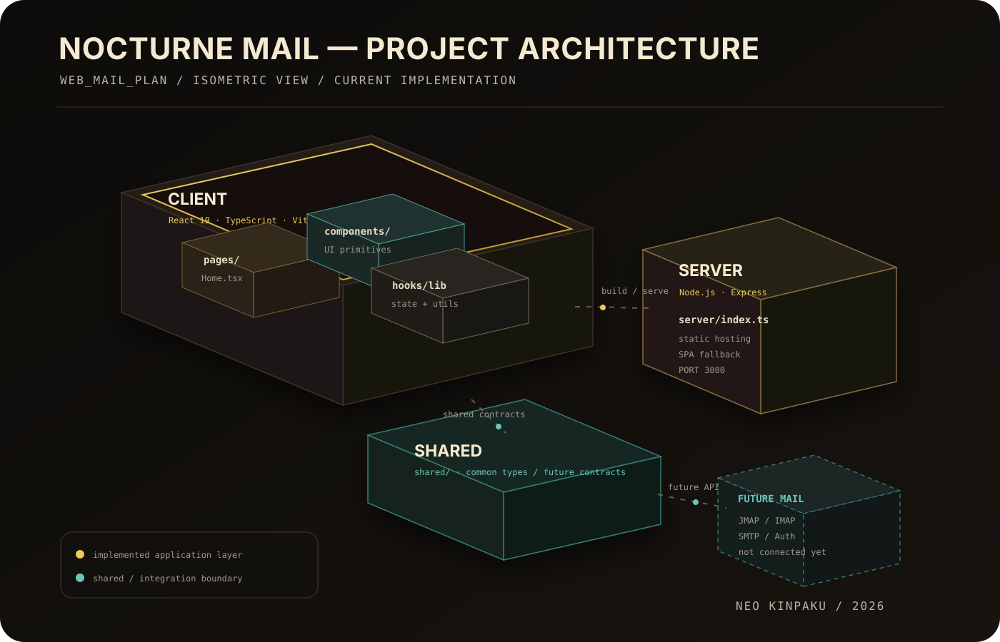

[](./README.md) [](./README.ko.md)

# Nocturne Mail

> **A premium webmail UI prototype in the Neo Kinpaku style**  
> This is not a production mail service connected to a real mail server. It is a frontend project for designing and validating the layout and interactions of a mail client.

`open_web_mail` is a webmail-interface prototype that keeps the familiar information architecture of ordinary webmail while exploring a visual experience that differs from Gmail and Outlook.

Inside the project, the product is called **Nocturne Mail**. Its design direction is **Neo Kinpaku**, combining the thin, irregular lines of Japanese gold-leaf craft, deep dark surfaces reminiscent of urushi lacquer, and turquoise patina signals with a modern mail-client UI.

The current implementation is at the UI/UX prototype stage. Inbox, starred mail, archive, search, message reading, and compose interactions are designed to feel like a real service. The messages displayed on screen are mock data, however, and the project is not connected to a real IMAP, SMTP, or JMAP server.

---

## 3D Project Structure

The current codebase is visualized as an **isometric 3D architecture diagram** so the project structure can be understood directly from the README.

<p align="center">
  
</p>

### Structure at a Glance

- **CLIENT** — the actual Nocturne Mail UI built with React 19 + TypeScript + Vite
- **SHARED** — area for client/server shared types and future API contracts
- **SERVER** — Node.js + Express server for serving production static files
- **FUTURE MAIL** — JMAP / IMAP / SMTP / authentication areas that are not connected yet

The core of the current structure is `client/src/pages/Home.tsx`, where the main UI state for the message list, reading view, compose interface, search/filtering, starred state, and related interactions is implemented.

<details>
<summary><strong>View the directory structure as text</strong></summary>

```text
open_web_mail/
├─ client/
│  ├─ public/
│  ├─ index.html
│  └─ src/
│     ├─ components/       # Shared UI components
│     ├─ contexts/         # React Context-related code
│     ├─ hooks/            # Custom hooks
│     ├─ lib/              # Utilities / shared logic
│     ├─ pages/
│     │  ├─ Home.tsx       # Main Nocturne Mail screen
│     │  └─ NotFound.tsx   # 404 screen
│     ├─ App.tsx           # Application root
│     ├─ main.tsx          # React entry point
│     ├─ const.ts          # Shared constants
│     └─ index.css         # Main styles
│
├─ server/
│  └─ index.ts             # Express server for production static files
│
├─ shared/                 # Client/server shared code
├─ patches/                # pnpm dependency patches
├─ docs/
│  └─ architecture-3d.svg  # 3D structure diagram used in README
├─ ideas.md                # Design direction and product concept
├─ verification.md         # Implementation verification notes
├─ components.json         # UI component configuration
├─ package.json
├─ pnpm-lock.yaml
├─ tsconfig.json
└─ README.md
```

</details>

---

## Current Implementation

### Mailbox UI

- Inbox
- Starred
- Snoozed
- Sent
- Drafts
- Archive
- Label/category display
- Read/unread state
- Starred state
- Attachment state
- Selected-message reading view

### Core Interactions

- Select and read messages
- Search/filter UI
- Star toggle
- Archive-related UI
- Refresh UI
- Compose interface
- Toolbar actions
- Toast notices for unimplemented actions
- Responsive layout

### Design Characteristics

- Asymmetric three-column desktop layout
- Left mail navigation
- Center mail workspace
- Right context panel
- Gold accents inspired by gold leaf
- Warm black-brown lacquer background
- Turquoise patina accents for unread/status signals
- Small monospace status labels
- Short, restrained UI animation
- Tablet/mobile responsive layouts

---

## Important: This Is Not a Real Mail Service

The current version does not send or receive real email.

The following features are not connected yet:

- IMAP server connection
- SMTP server connection
- JMAP server connection
- Real user login/authentication
- Server-side inbox synchronization
- Real email sending
- Real attachment upload/download
- Mail-server folder/label synchronization
- Persistent read/unread state
- Persistent star/archive/delete state

The interface currently uses mock mail data defined inside `Home.tsx`.

So the most accurate description of this repository is a **webmail design prototype / frontend foundation for a real webmail client**.

---

## Tech Stack

### Frontend

- React 19
- TypeScript
- Vite
- Tailwind CSS
- Radix UI
- Lucide React
- Framer Motion
- Sonner
- Wouter
- React Hook Form
- Zod

### Server

- Node.js
- Express

The current Express server is not a mail API server. It only serves the production build output as static files.

### Package Manager

- pnpm

---

## Installation

### 1. Clone the Repository

```bash
git clone https://github.com/homesweetlove/open_web_mail.git
cd open_web_mail
```

### 2. Install pnpm

Skip this step if pnpm is already installed.

```bash
npm install -g pnpm
```

Or use Node.js Corepack:

```bash
corepack enable
```

### 3. Install Dependencies

```bash
pnpm install
```

---

## Run the Development Server

```bash
pnpm dev
```

Vite starts the development server. Open the local address printed in the terminal to view Nocturne Mail.

The usual address is:

```text
http://localhost:5173
```

If that port is already in use, Vite may choose another one, so use the address shown in the terminal.

---

## TypeScript Check

```bash
pnpm check
```

This runs TypeScript checking with `tsc --noEmit`.

---

## Code Formatting

```bash
pnpm format
```

Formats the project with Prettier.

---

## Production Build

```bash
pnpm build
```

The build process:

1. Builds the frontend with Vite.
2. Bundles `server/index.ts` with esbuild.
3. Generates the production output under `dist`.

After a successful build:

```bash
pnpm start
```

The production server uses port `3000` by default.

Linux/macOS:

```bash
PORT=8080 pnpm start
```

PowerShell:

```powershell
$env:PORT=8080
pnpm start
```

---

## Preview Mode

```bash
pnpm preview
```

This provides a simple preview of the Vite production build.

---

## Main npm/pnpm Scripts

| Command | Description |
|---|---|
| `pnpm dev` | Start the Vite development server |
| `pnpm build` | Build the frontend + Express production server |
| `pnpm start` | Run the built production server |
| `pnpm preview` | Run the Vite preview server |
| `pnpm check` | TypeScript type checking |
| `pnpm format` | Format all code with Prettier |

---

## Main Screen Code

The center of the current project is:

```text
client/src/pages/Home.tsx
```

This file contains the mock message data, inbox state, selected-message state, search/filter UI, compose interface, and other core Nocturne Mail screen logic.

Mock messages use a structure similar to:

```ts
type MailItem = {
  id: number;
  sender: string;
  initials: string;
  subject: string;
  preview: string;
  time: string;
  date: string;
  label: string;
  tone: "gold" | "patina" | "paper" | "graphite";
  unread?: boolean;
  starred?: boolean;
  attachment?: boolean;
  body: string[];
};
```

When a real mail server is connected, this mock data can be replaced by server response data.

---

## Design Concept

The detailed design intent is documented in [`ideas.md`](./ideas.md).

### Neo Kinpaku

This is the central visual direction of Nocturne Mail.

The goal is to combine the material feeling of Japanese gold-leaf craft with a modern information interface, creating a mail environment that feels more tactile and focused than a generic SaaS dashboard.

### Core Principles

#### 1. Decoration becomes structure

Gold lines, small labels, and status signals are used as information architecture that guides attention, not merely as ornament.

#### 2. Black is not treated as a flat black

Instead of filling the whole page with a flat `#000000`, several warm black-brown and graphite layers create depth.

#### 3. High information density and whitespace coexist

The message list remains dense enough to scan quickly, while search, titles, and reading areas retain generous whitespace.

#### 4. Interactions stay quiet and fast

State changes are communicated through short movement and color changes rather than excessive glow, bounce, or large animation.

---

## Responsive Design

### Desktop

```text
┌──────────────┬────────────────────────────┬──────────────────┐
│ Navigation   │ Mail workspace             │ Context rail     │
│              │                            │                  │
│ Inbox        │ Mail list / message        │ Status / details │
│ Starred      │                            │                  │
│ Sent         │                            │                  │
└──────────────┴────────────────────────────┴──────────────────┘
```

### Tablet

- Collapse or hide the right context area
- Focus on a two-column navigation + reading layout

### Mobile

- Primarily single-column
- Left navigation becomes a drawer
- Move between message list and message body in stages

---

## Extending It into a Real Webmail Client

A real mail server or mail API must be connected to turn the current UI into an actual mail service.

### JMAP

With a JMAP-capable server such as Stalwart Mail Server:

```text
Nocturne Mail
      │
      │ HTTPS / JMAP
      ▼
Mail Server
      │
      ├─ Mailbox
      ├─ Email
      ├─ Thread
      ├─ Submission
      └─ Identity
```

The frontend can communicate directly with the server or through a separate backend API.

### IMAP + SMTP

For broader compatibility with traditional mail servers:

```text
Frontend
   │
   ▼
Application Backend
   ├─ IMAP  → message retrieval / folders / state
   └─ SMTP  → message sending
```

Using a backend such as Node.js between the browser and IMAP/SMTP is generally preferable to connecting directly from the browser.

---

## Work Needed for a Real Service

1. User authentication
2. Mail-account registration or server-account linking
3. JMAP or IMAP client implementation
4. Real inbox retrieval
5. Message-body retrieval
6. Read/unread synchronization
7. Star/archive/delete operations
8. Compose and send
9. Attachment upload/download
10. Draft persistence
11. Real-time or periodic mail synchronization
12. Search
13. Error handling and reconnection
14. Stronger session/token security

---

## Intended Uses

This repository is useful for:

- Webmail UI design experiments
- A personal mail-client frontend foundation
- Starting a JMAP client
- Building a Stalwart-based webmail frontend
- Reference for React dashboard/mail layouts
- Prototyping responsive three-pane mail interfaces

In its current state, it cannot be used for:

- Signing into Gmail and reading real mail
- Sending/receiving mail for a custom domain
- SMTP sending
- IMAP inbox access
- Replacing an operational mail service

Those features require separate server integration.

---

## Development Notes

### Mock Data

The current mail data is not loaded from a real server. It is embedded in the code for UI testing, so changing or resetting it has no effect on any real email.

### Express Server

`server/index.ts` does not currently function as an API server.

```text
Browser
   │
   ▼
Express
   │
   └─ serves static files from dist/public
```

For SPA routing, undefined paths return `index.html`.

### State Persistence

Most current UI state lives in client memory. Some interaction state may therefore reset after a page refresh.

---

## Recommended Development Environment

- Node.js: latest LTS recommended
- pnpm: latest compatible pnpm 10.x matching the project's `packageManager` configuration
- VS Code, Cursor, Codex, or another TypeScript-capable editor

The minimum startup flow after cloning is:

```bash
git clone https://github.com/homesweetlove/open_web_mail.git
cd open_web_mail
pnpm install && pnpm dev
```

---

## License

The project's `package.json` currently declares the MIT license.

Before public deployment or distribution, it is recommended to add a dedicated `LICENSE` file and review the licenses of external libraries and assets as well.

---

## Summary

**Nocturne Mail is a React-based UI prototype for designing a production-grade webmail experience, not a real mail server.**

Even in its current state it demonstrates the layout and primary interactions of a mail client. By connecting JMAP, IMAP/SMTP, or a custom mail-server API, it can be expanded into a usable webmail client.
